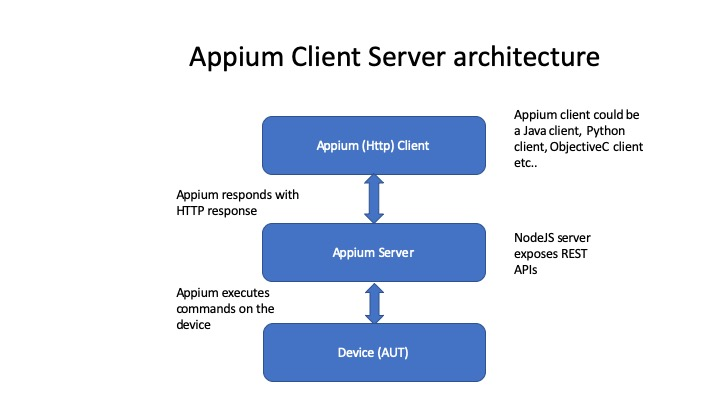
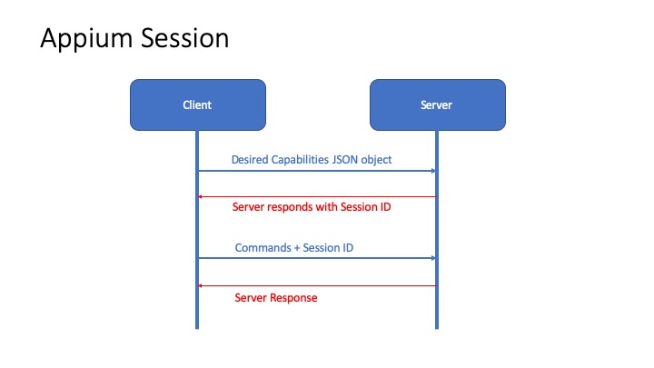

# Appium Introduction
## Client/Server architecture
Appium is based on client-server protocol. Appiumm server is developed in NodeJS, which exposes REST APIs. 

Appium client is a HTTP client which sends commands to the appium server through REST APIs. 

Appium server listens to these commands and exutes them on the device and send the HTTP response back to the client



## Session
To establish a HTTP connection, you need a session to communicate between the client and the server. 

Appium clients initiate a session with a server by seding JSON object called the 'desired capabilities' object.



**Desired capabilities** are a set of keys and values (i.e., a map or hash) sent to the Appium server to tell the server what kind of automation session we're interested in starting up. E.g. 

```json
{
    "platformName": "iOS",
    "platformVersion": "11.0",
    "deviceName": "iPhone 7",
    "automationName": "XCUITest",
    "app": "/path/to/my.app"
}
```

Server creates a session and resonds to the session request with a session ID.

Client uses this session ID in all further communication with server.

