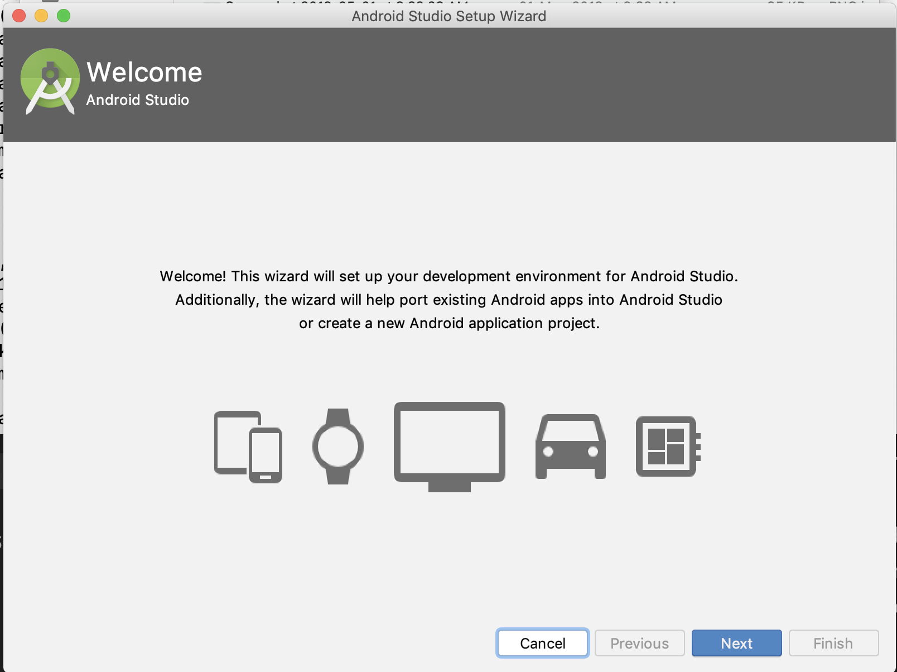
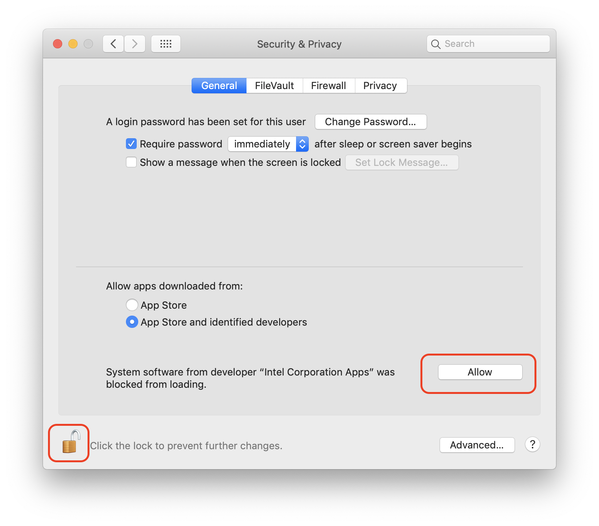
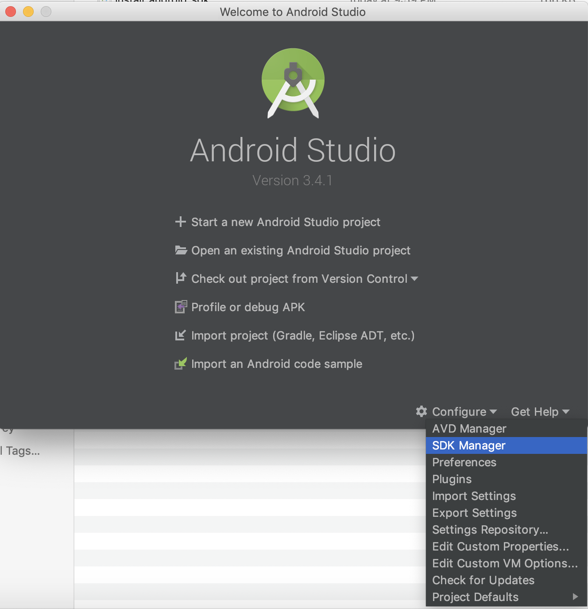
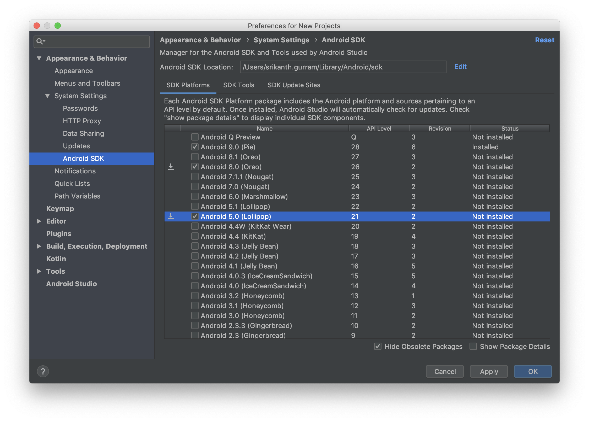
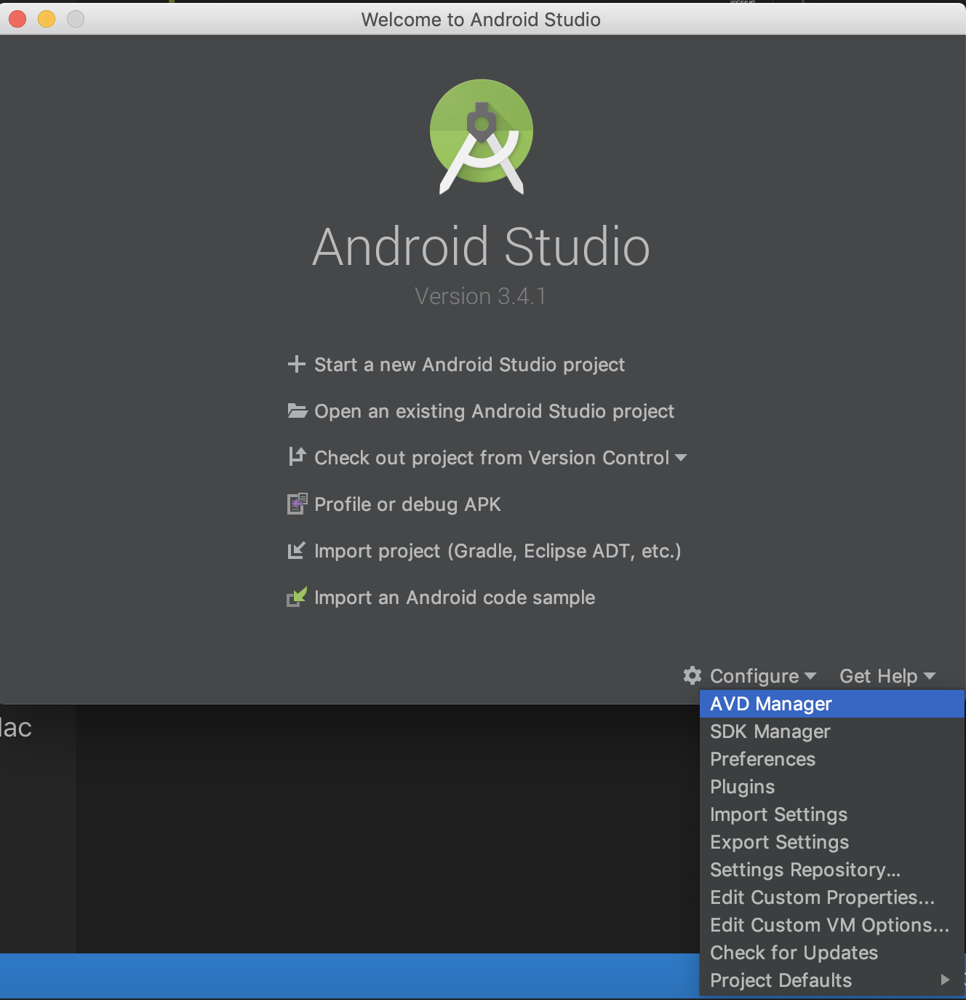
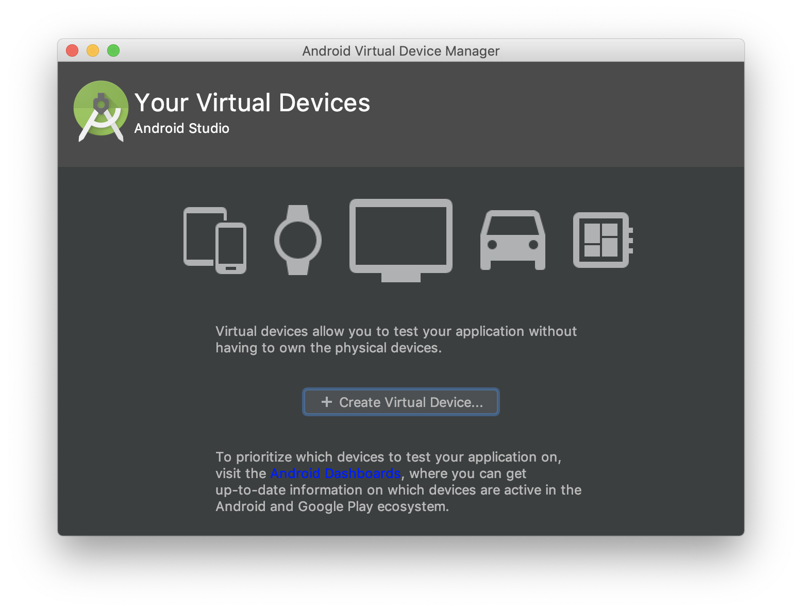
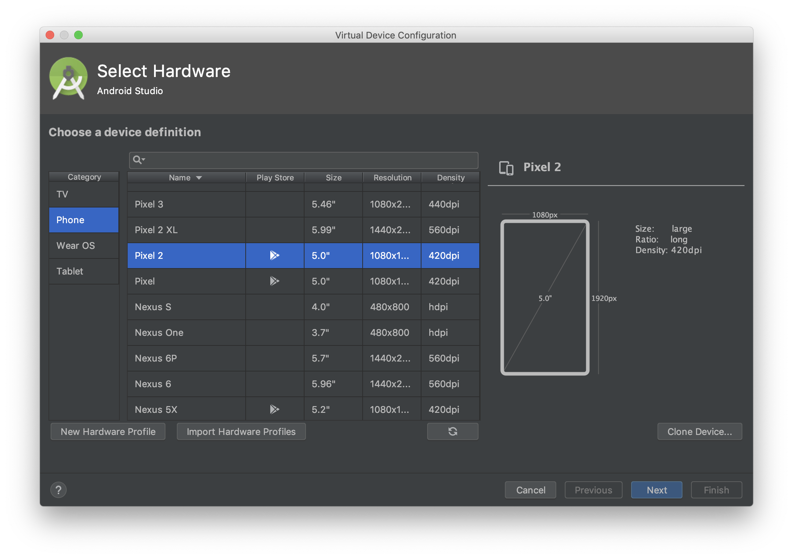
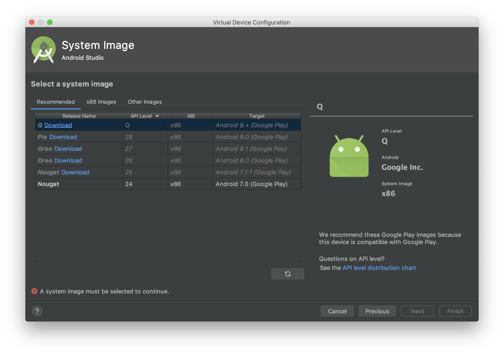
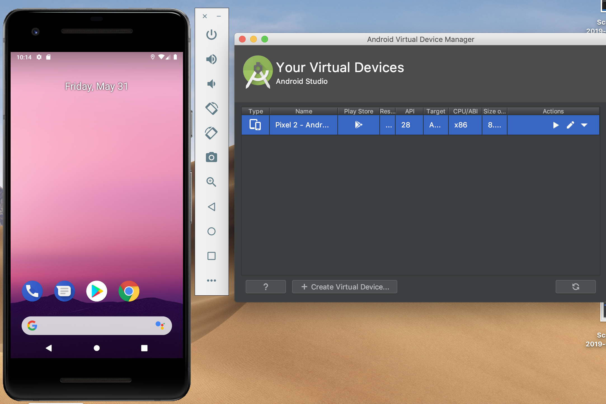

# Basic Setup
1. Install Java Development Kit (JDK)
    * Install JDK version 7 and above
    * Add JDK installation location to your PATH environment variable
    * Set JAVA_HOME environment variable, make it point to your Java/JDK installation path
1. Install Android SDK
    * Install Android SDK using Android studio or command line tools
    * Set ANDROID_HOME environment variable, make it point to your Android SDK installation path
    * Using Android SDK Manager, install the Android API level 16 (Android 4.2) or above based on your requiremnent
1. Setup Emulator
    *   Use AVD manager that is included in Android SDK to create the emulator
1. Setup Real device
    * Connect your real device to the PC/Mac
    * Enable "Developer Mode"
    * Disable "Verify Apps" in Settings

## Setup Android SDK
1. Download and Install [Android Studio](https://developer.android.com/studio/index.html)
1. Launch Android Studio from Applications

1. Choose the default settings in all the subsequent screens
1. (for Mac) While installing the SDK, your Mac may block installing Intel drivers, unlock the system preferences and click on Allow

1. Wait for the Android SDK to be download and install
1. Launch SDK Manager from Android studio splash screen or from menu options
1. Select Android SDK platforms on which you want to test your Application (AUT) and click on Apply button to download them
(
1. Copy the Android SDK location displayed in the SDK manager and set it as ANDROID_HOME environment variable

## Setup Emulator on Mac
1. Launch AVD Manager from Android Studio splash screen or from menu options

1. Click on "Create Virtual Device"

1. Select the device on which you want to test your application and click on Next button

1. Select the system image. System image is the android version on which you wanted to test. Download the system image if it is not already exists. E.g. in the following screen, I wanted to test my application on Google Pixel2 with Android 9.0. But, I have only "Nogat" exists, I can choose to download "Pie (9.0)" by clicking on the 'Download' link next to the image.

1. After downloading the system image, choose the system image and click on Next
1. Set a AVD name and choose other parameters like orientation etc and click on Finish
1. After the AVD is successfully created, it will be listed under virtual devices in virtual device manager.
1. Click on Play button next to the device in AVD manager to launch the device

